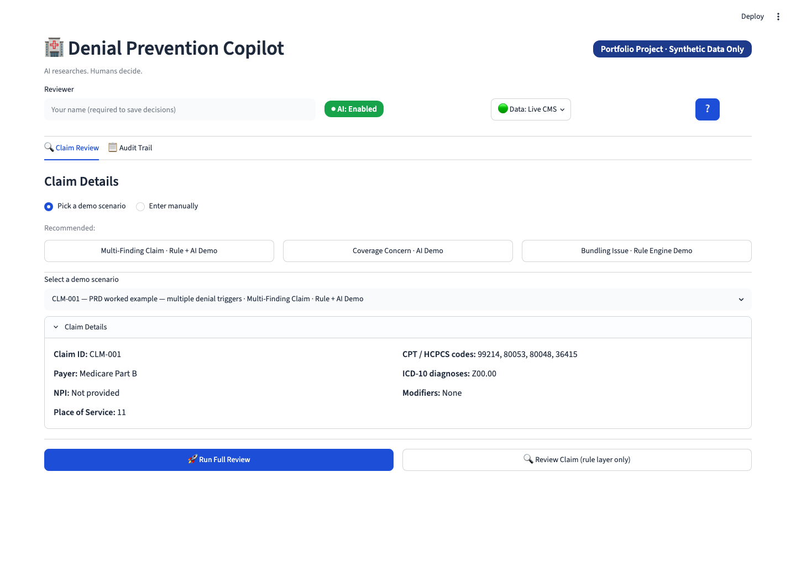
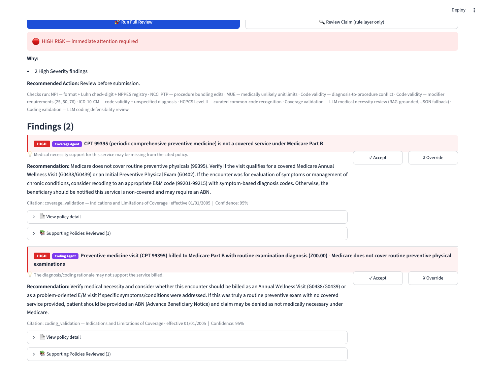
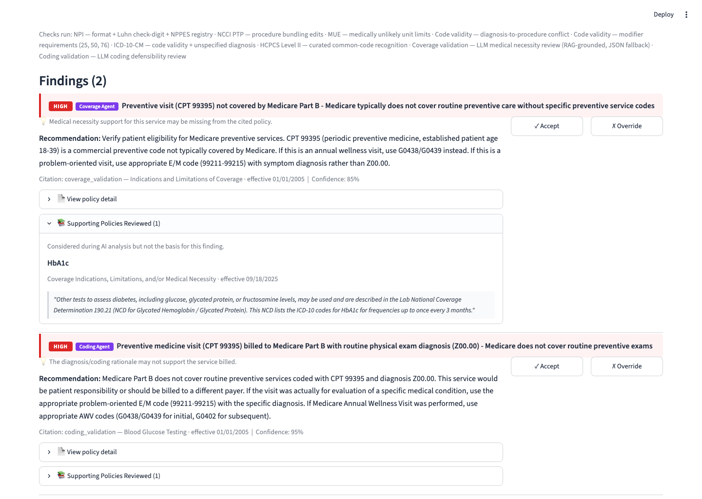
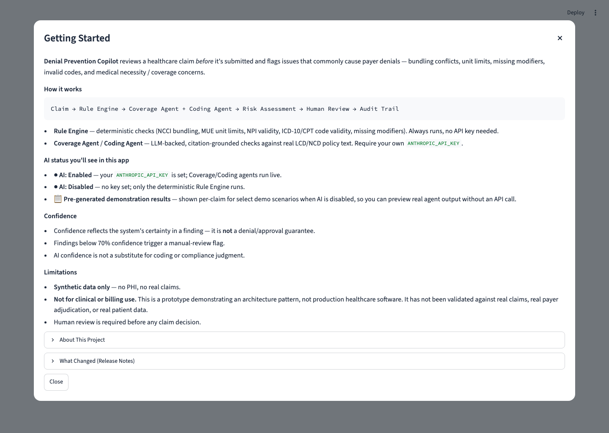

# Denial Prevention Copilot

A portfolio / demo project: agentic pre-submission claim review that catches denial risks before a claim leaves the building. A deterministic rule layer (NCCI, MUE, NPI, code validity) and two citation-grounded LLM agents — Coverage Validation (medical necessity) and Coding Validation (diagnosis specificity, coding defensibility, payer scrutiny risk) — feed a single Unified Review that synthesizes a denial risk score. Every AI finding is backed by a cited LCD/NCD source. Humans make every final call.

A Documentation Review Agent remains part of the product vision and roadmap but is currently deferred (not implemented, not required for this MVP) — see `docs/Roadmap.md` Phase 6.

Built on free public data: NPPES NPI Registry, CMS Coverage API (NCDs/LCDs), NCCI PTP and MUE files, the real CMS ICD-10-CM order file. HCPCS Level II is recognized via a small curated common-code set, not a full reference-file loader (see `docs/Technical_Debt_Register.md` TD-06). **Synthetic data only — no PHI, no real claims.**

> **Not for clinical or billing use.** This is a synthetic-data prototype demonstrating an architecture pattern, not production healthcare software. It is not HIPAA certified and has not been validated against real claims, real payer adjudication, or real patient data. Do not use it to make actual coverage, coding, or billing decisions.

## Current Public Release

**V1.0 MVP**

Denial Prevention Copilot has reached MVP status and is publicly released.

The MVP includes:

- Deterministic claim validation
- NPI validation
- NCCI bundling checks
- MUE validation
- ICD-10 validation
- HCPCS validation
- Modifier validation
- Coverage Validation Agent
- Coding Validation Agent
- Citation grounding
- Supporting Policies Reviewed
- Risk scoring
- Human review workflow
- Audit trail
- Manual claim review
- Streamlit Cloud deployment hardening
- Self-healing audit database initialization
- Graceful ChromaDB fallback behavior
- Live CMS rule-layer support using maintainer-managed GitHub Release Assets
- Expanded automated test coverage (549+ passing tests)

Engineering release history continues internally through v1.9.x releases, which represent deployment, reliability, testing, and operational hardening improvements beyond the original MVP scope. The public V1.0 MVP designation corresponds to engineering releases v1.8a (UI polish and first-time UX), v1.8b (citation transparency / Supporting Policies Reviewed), and v1.9.x (Streamlit Cloud deployment readiness, audit-schema self-healing, ChromaDB graceful fallback, and manual-claim AI execution parity). The in-app "Getting Started" → "What Changed" notes show only the public-facing V1.0 MVP summary; full engineering version history — v1.0 through v1.9.x — is preserved in `docs/Roadmap.md`. 523 tests passing. Default AI model: Claude Sonnet 4.6 (override with `ANTHROPIC_MODEL`). See `docs/Technical_Debt_Register.md` for the full TD-24 calibration history and the Haiku/Sonnet/Opus model comparison behind that choice.

## Demonstrated Capabilities

- Deterministic claim validation
- NCCI bundling detection
- MUE validation
- ICD-10 validation
- Coverage policy review
- Coding validation
- Human-in-the-loop review workflow
- Audit trail and governance
- Explainable findings with citations
- Live CMS reference datasets (current implementation)

## Screenshots

| | |
|---|---|
|  |  |
| Header bar (AI status, data-source status, Getting Started) with the demo-scenario landing state | Findings with severity + source badges (Rule Engine / Coverage Agent / Coding Agent) |
|  |  |
| "Supporting Policies Reviewed" — every policy an AI agent considered, not just the one it cited (TD-22) | The Getting Started onboarding dialog |

## Setup

```bash
python -m venv .venv
source .venv/bin/activate
pip install -r requirements.txt
cp .env.example .env   # optional — see "AI features" below
```

## Run

```bash
streamlit run app/main.py
```

The app runs fully on a fresh clone with no `ANTHROPIC_API_KEY` — no setup beyond `pip install` is required to launch it or to use the deterministic rule-engine review (NCCI, MUE, NPI, code validity). See **AI features** below for what changes with a key.

`runtime.txt` pins Python 3.13 for Streamlit Cloud compatibility — newer Python runtimes have been observed to break `chromadb`'s `opentelemetry`/`protobuf` import chain. ChromaDB itself is optional at runtime: `retrieval/vector_store.py` imports it defensively, and if the import fails for any reason, the Coverage and Coding Validation agents transparently fall back to the curated JSON policy corpus (`retrieval/policy_repository.py`) — the same fallback path already used whenever the vector store is empty or unseeded. The app starts and serves findings either way; only the retrieval source changes.

## AI features (optional, requires an API key)

The Coverage Validation and Coding Validation agents call the Anthropic API and need an `ANTHROPIC_API_KEY`. Without one:

- The header status pill shows **"● AI: Disabled"**, and the in-page AI sections show **"⚠ AI Agents Disabled"** — the app never attempts an Anthropic call and never constructs an Anthropic client.
- The deterministic rule-engine review (NCCI, MUE, NPI, code validity) remains fully available.
- Three designated sample claims display **pre-generated, clearly labeled** ("📋 Pre-generated demonstration results") AI findings captured from a real run, so you can preview representative agent output without making a live API call. See `docs/Demo_Script.md`.

There are two ways to enable live AI:

1. **App owner — environment variable or Streamlit secrets** (persistent, for everyone using this deployment):
   ```bash
   cp .env.example .env
   # edit .env and set ANTHROPIC_API_KEY=sk-ant-...
   ```
2. **Any user — session key via the UI** (temporary, for just your browser session): click the **⚙️** icon next to the AI status pill, paste your own key, and click "Enable AI." The key is held only in Streamlit's session state — never written to disk, never logged, never stored in the audit trail — and disappears when you click "Clear Key" or the browser session ends. A session key takes priority over an app-owner key for the rest of that session.

Either way, the header status pill shows **"● AI: Enabled"** and both agents run as part of "Run Full Review."

## UI overview (v1.8a/v1.8b)

The app has no sidebar — the reviewer name field and two status pills live in a header bar at the top of the page:

- **AI status pill** — "● AI: Enabled" / "● AI: Disabled", reflecting whether an `ANTHROPIC_API_KEY` is set (session key, environment variable, or Streamlit secrets). A small **⚙️** icon next to the pill opens a popover for entering your own key for the current session.
- **Data Source Status pill** — "Data: Live CMS" / "Data: Synthetic fallback" / "Data: Mixed", reflecting whether `rules/data_source_status.py` found the real NCCI/MUE/ICD-10 reference files locally or is serving the small synthetic fallback tables (see TD-27 in `docs/Technical_Debt_Register.md`).
- **❔ Getting Started** — an onboarding dialog covering how the system works, AI/demo-mode states, the confidence legend, limitations, and full version history.

Claim entry is a single "Claim Details" flow: pick "Pick a demo scenario" or "Enter manually" — there's no separate Sample Claim/Manual Claim Entry tab split.

AI-sourced finding cards include a **"Supporting Policies Reviewed"** section listing other LCD/NCD policies the agent retrieved and considered but didn't cite as the basis for the finding (TD-22) — separate from the primary citation, so it's never read as additional evidence.

The audit database initializes automatically on first app load — no manual setup step is required, and the schema is re-applied (idempotently) on every connection, so it self-repairs if the underlying file is ever recreated empty mid-session. The audit trail is demo-local: on hosted deployments such as Streamlit Cloud, audit history may reset when the app restarts, redeploys, or sleeps — acceptable here since the app uses synthetic demo data only.

## Live CMS Data (optional, Phase 11)

The real NCCI/MUE/ICD-10 reference files (~266MB combined) are gitignored and never committed (see TD-27 in `docs/Technical_Debt_Register.md`) — a fresh clone or hosted deployment normally runs on the small curated synthetic fallback tables instead. Phase 11 adds an **optional** way for a hosted deployment to use the real datasets anyway: if the repo maintainer configures GitHub Release Asset URLs as environment variables (or Streamlit Cloud secrets), the app downloads them once per process into a temp-directory cache and uses them exactly as if they'd been placed locally.

```bash
CMS_NCCI_F1_URL=https://github.com/<org>/<repo>/releases/download/<tag>/ccipra-v322r0-f1.xlsx
CMS_NCCI_F2_URL=...
CMS_NCCI_F3_URL=...
CMS_NCCI_F4_URL=...
CMS_MUE_URL=https://github.com/<org>/<repo>/releases/download/<tag>/MCR_MUE_PractitionerServices_Eff_07-01-2026.xlsx
CMS_ICD10_URL=https://github.com/<org>/<repo>/releases/download/<tag>/icd10cm_order_2026.txt
```

All six are optional and independent — set none, some, or all. Behavior:

- **None configured** (the default, e.g. on a fresh clone): no download is attempted, nothing changes from today's behavior — local files if present, synthetic fallback otherwise.
- **Some/all configured, download succeeds**: the file is cached under `tempfile.gettempdir()/denial_copilot_cms_cache/` and used exactly like a local file — the header "Data:" pill shows "🟢 Live CMS" (or "🟡 Mixed" if only some datasets downloaded), and its popover notes "📥 Downloaded from a configured GitHub Release Asset."
- **Configured but the download fails** (network error, timeout, bad URL): the failure is caught and logged, nothing crashes, and the app falls back to the local file or synthetic table exactly as if nothing had been configured — the popover notes the attempt and its error instead of silently hiding it.
- **Caching is per-process, not permanent**: a download is attempted at most once per running process (mirroring the existing audit-DB and ChromaDB self-healing patterns) — a Streamlit Cloud restart/redeploy/sleep-wake re-attempts it lazily on first access, it does not "remember" across restarts.

Asset URLs must point at actual tagged GitHub Release assets (`.../releases/download/<tag>/<file>`), not ephemeral `github.com/user-attachments/...` comment-attachment links, which aren't guaranteed to remain stable. No URL is hardcoded anywhere in the codebase — the feature is entirely opt-in via configuration, and no secret/credential is required (these are public file URLs, not API keys).

This sprint covers only the rule-layer datasets (NCCI, MUE, ICD-10) and the Data Source Status pill. Coverage/Coding policy retrieval (Chroma vs. JSON fallback) is unchanged and out of scope here — see `docs/Roadmap.md` for that as a separate future phase.

## Test

```bash
pytest tests/
```

## Evaluate

A golden-set evaluation harness measures finding precision/recall/F1 against a labelled set of synthetic claims:

```bash
python -m evaluation.run_evaluation          # offline — no Anthropic calls, rule layer measured for real
python -m evaluation.run_evaluation --live    # real Coverage/Coding Agent calls (default model: claude-sonnet-4-6, override with ANTHROPIC_MODEL)
```

Saves `latest_report.md`, `latest_results.json`, and `latest_summary.json` to `evaluation/`. Current live benchmark (15-claim golden set, Phase 3B prompt calibration):

| Category | Precision | Recall | F1 |
|---|---|---|---|
| Overall | 0.92 | 0.85 | 0.88 |
| Rule Engine | 1.00 | 1.00 | 1.00 |
| Coverage Agent | 1.00 | 0.50 | 0.67 |
| Coding Agent | 0.60 | 0.60 | 0.60 |

See `docs/Roadmap.md` Phase 8 and `docs/Technical_Debt_Register.md` TD-09/TD-24 for full results, the Haiku/Sonnet/Opus model comparison behind the default-model choice, and known gaps (15-claim set is still too small to be statistically significant; TD-24 remains partially resolved).

## Architecture Overview

Full product spec: `docs/PRD_Agentic_Claims_Review_and_Denial_Prevention_Copilot.pdf`.

```
Claim intake (app/) → orchestrator.py
  → rules/ (NPI, code validity, NCCI PTP, MUE)   ← synchronous, short-circuits on hard failure
  → agents/ (coverage, coding) sequentially       ← LLM-backed, skipped entirely with no API key
  → denial_prevention.py (synthesis, risk score)  ← deterministic over structured Finding objects
  → db/audit.py (immutable write)
  → app/ (findings panel, human decision)
```

**Rule Layer** (`rules/`) — always runs first, no LLM call:
- `rules/npi.py` — live NPPES NPI Registry lookup, Luhn check-digit validation; a HIGH invalid-NPI finding short-circuits everything downstream
- `rules/ncci.py` — NCCI PTP procedure-bundling edits, loaded from real CMS quarterly files (small synthetic fallback if the files aren't present locally — see `rules/data_source_status.py` for a programmatic real-data-vs-fallback check, TD-27)
- `rules/mue.py` — MUE unit limits, MAI-aware severity
- `rules/code_validity.py` — diagnosis-to-procedure conflict and modifier rules (25, 76/77 repeat-procedure, 50 bilateral)
- `rules/icd10.py` / `rules/icd10_loader.py` — ICD-10-CM code validity and unspecified-diagnosis detection against the real CMS order file
- `rules/hcpcs.py` — HCPCS Level II format recognition against a small curated common-code set (not a full reference-file loader — see `docs/Technical_Debt_Register.md` TD-06)

**AI Layer** (`agents/`) — only runs if `ANTHROPIC_API_KEY` is set:
- `agents/coverage_validation.py` — RAG over LCD/NCD chunks → LLM reasoning → cited medical-necessity findings
- `agents/coding_validation.py` — LLM coding-defensibility review (diagnosis specificity, payer scrutiny risk)
- `agents/documentation_review.py` — deferred, not implemented (see `docs/Roadmap.md` Phase 6)
- `agents/run_logger.py` — structured local logging (timestamp, claim_id, agent, finding_count, success, latency_ms) for each check the orchestrator dispatches

**Orchestration:**
- `agents/orchestrator.py` — Python controller, not an agent loop: runs the rule layer, gates the two agents on both the NPI short-circuit and key presence, then passes everything to synthesis. Agents never call each other or spawn sub-agents.
- `agents/denial_prevention.py` — deterministic synthesis of all findings into a `RiskAssessment` — no LLM call here.
- `db/audit_repository.py` — append-only audit log (INSERT only, no UPDATE/DELETE) for every human Accept/Override decision.

**Evaluation:**
- `evaluation/` — a golden-set harness that runs the same orchestrator end-to-end against labelled synthetic claims and reports precision/recall/F1 per finding category, in both offline (no API calls) and live modes.

Citation grounding is the load-bearing constraint throughout: an AI finding with no retrieved source is suppressed, never displayed.
